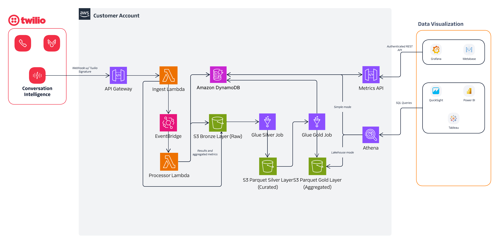

# Conversational Intelligence Reporting Layer (CIRL)

Transform Twilio Conversational Intelligence operator results into a queryable data layer for analytics and dashboards.

## What You Get

- **Webhook ingestion** with Twilio signature validation and async processing
- **REST API** for conversations, metrics, and operator results
- **SQL query layer** via Athena for standard BI tools (simple or lakehouse mode)
- **BI-agnostic design** - Connect QuickSight, Tableau, PowerBI, Looker, Grafana, Metabase
- **Automatic metrics aggregation** at ingestion-time
- **Multi-tenant support** with flexible schema validation
- **Demo mode** with sample data for quick evaluation

## Architecture



## Choose Your Analytics Mode

CIRL supports three analytics modes. All share the same ingestion pipeline, REST API, and DynamoDB storage. They differ in whether and how BI tools query the data via Athena.

| | **None** (default) | **Simple** | **Lakehouse** |
|---|---|---|---|
| **Stacks deployed** | Storage + API | Storage + API + Athena Connector | Storage + API + Glue/Parquet/Athena |
| **How BI tools query** | REST API only (Grafana, Metabase) | Athena → DynamoDB (federated query) | Athena → S3 Parquet (Glue ETL) |
| **Data freshness** | Real-time | Real-time | Batch (depends on ETL schedule) |
| **Operational overhead** | Zero | Low (connector Lambda) | Must run Glue ETL jobs |
| **Best for** | POCs, Grafana, Flex plugins, API-first | SQL-based BI tools, <100K conv/month | >100K conv/month, heavy analytics |
| **Set in `.env`** | `CIRL_ANALYTICS=none` | `CIRL_ANALYTICS=simple` | `CIRL_ANALYTICS=lakehouse` |

You can start with `none` and upgrade to `simple` or `lakehouse` later without losing data.

### Architecture

```
┌─────────────┐
│ Twilio CI   │
│  Webhooks   │
└──────┬──────┘
       │
       v
┌─────────────────────────────────────────────────┐
│  Ingest Lambda                                  │
│  • Validates Twilio signature                   │
│  • Stores raw payload to S3                     │
│  • Emits EventBridge event                      │
└──────┬──────────────────────────────────────────┘
       │
       v
┌─────────────────────────────────────────────────┐
│  Processor Lambda                               │
│  • Schema validation                            │
│  • Custom enrichment hooks                      │
│  • Writes to DynamoDB (single table)            │
│  • Calculates aggregate metrics                 │
└──────┬──────────────────────────────────────────┘
       │
       ├──────────────────────────────┐
       v                              v
┌──────────────────────┐    ┌──────────────────┐
│  DynamoDB            │    │  Raw S3 Bucket   │
│  (Single Table)      │    │  (JSON archive)  │
│  • Conversations     │    └──────┬───────────┘
│  • Operator Results  │           │
│  • Metrics           │           │
└──────┬───────────────┘           │
       │                           │
       ├──── REST API ────┐        │
       │                  │        │
       │   ┌──────────────┤        │
       │   │  SIMPLE MODE │        │   LAKEHOUSE MODE
       │   │              │        │
       v   v              │        v
┌──────────────┐   ┌──────┴───┐  ┌──────────────────┐
│ Grafana,     │   │ Athena   │  │ Glue ETL         │
│ Metabase,    │   │ DynamoDB │  │ Bronze→Silver    │
│ Custom Apps  │   │ Connector│  │ Silver→Gold      │
└──────────────┘   │ (federate│  └──────┬───────────┘
                   │  d query)│         v
                   └──────┬───┘  ┌──────────────────┐
                          │      │ S3 Parquet +     │
                          │      │ Athena           │
                          v      └──────┬───────────┘
                   ┌─────────────┐      │
                   │ QuickSight, │◄─────┘
                   │ Tableau,    │
                   │ PowerBI     │
                   └─────────────┘
```

## Quick Start

### Prerequisites

- Node.js 22+
- AWS CLI configured with credentials
- AWS CDK CLI (`npm install -g aws-cdk`)
- Twilio Account SID and Auth Token

### 1. Configure Environment

```bash
cp .env.example .env
```

Edit `.env`:
```bash
AWS_REGION=us-east-1
CIRL_ENV=demo
CIRL_TENANT_ID=your-tenant-id

# Analytics mode: none (default), simple, or lakehouse
# Start with none — upgrade to simple or lakehouse when needed
# CIRL_ANALYTICS=none

TWILIO_ACCOUNT_SID=ACxxx...
TWILIO_AUTH_TOKEN=xxx...
```

### 2. Deploy Infrastructure

```bash
# Install dependencies
npm install

# Bootstrap CDK (first time only)
cd infra/cdk && npx cdk bootstrap

# Deploy
npm run deploy:demo
```

### 3. Note Your API Endpoints

After deployment:
```
✅  CirlDemoApiStack

Outputs:
CirlDemoApiStack.ApiUrl = https://xxx.execute-api.us-east-1.amazonaws.com/v1/
CirlDemoApiStack.WebhookUrl = https://xxx.execute-api.us-east-1.amazonaws.com/v1/webhook/ci
```

### 4. Configure Twilio CI Webhook

Set the webhook URL in your Twilio Voice Intelligence service configuration to point to the `WebhookUrl` from above.

### 5. Test with Sample Data

```bash
npm run demo:seed
```

---

## API Reference

### Base URL
```
https://{api-id}.execute-api.{region}.amazonaws.com/v1
```

### Endpoints

#### List Conversations
```http
GET /tenants/{tenantId}/conversations
```

Query Parameters:
- `from` - ISO date filter (e.g., `2026-01-20`)
- `to` - ISO date filter
- `agentId` - Filter by agent
- `queueId` - Filter by queue
- `customerKey` - Filter by customer
- `{indexedField}` - Filter by any `surfaceInList` operator field (e.g., `handoff_reason=LACK_OF_KNOWLEDGE`)
- `limit` - Max results (default: 50, max: 500)
- `nextToken` - Pagination token

Response:
```json
{
  "items": [
    {
      "conversationId": "GT...",
      "tenantId": "your-tenant",
      "channel": { "type": "voice", ... },
      "startedAt": "2026-01-27T10:00:00Z",
      "operatorCount": 5
    }
  ],
  "nextToken": "..."
}
```

#### Get Single Conversation
```http
GET /tenants/{tenantId}/conversations/{conversationId}
```

Response:
```json
{
  "conversation": {
    "conversationId": "GT...",
    "operatorCount": 5,
    ...
  },
  "operators": [
    {
      "operatorName": "conversation-summary",
      "schemaVersion": "1.0",
      "enrichedPayload": { ... },
      "displayFields": { ... }
    }
  ]
}
```

#### Get Metrics
```http
GET /tenants/{tenantId}/metrics
```

Query Parameters:
- `from` - Start date (default: 30 days ago)
- `to` - End date (default: today)
- `metric` - Filter by internal metric name (see Available Metrics below)

> **Note:** The response includes both `metricName` (internal, e.g., `poc_topic_atendimento`) and `displayName` (friendly, e.g., `Atendimento`). The `metric` filter parameter uses internal names. Use `displayName` for chart labels and legends in BI tools.

Response:
```json
{
  "metrics": [
    { "date": "2026-04-28T00:00:00Z", "metricName": "conversation_count", "value": 42, "displayName": "Conversas" },
    { "date": "2026-04-28T00:00:00Z", "metricName": "poc_csat_avg", "value": 4.2, "displayName": "CSAT Média" },
    { "date": "period",                "metricName": "poc_handoff_lack_of_comprehension_rate_percent", "value": 12.5, "displayName": "Transbordo: Falta de Compreensao (%)" }
  ],
  "period": { "from": "2026-04-22", "to": "2026-04-28" }
}
```

**Available Metrics:**

CIRL emits two layers of metrics, both queryable through the same API:

*Built-in (always present):*
- `conversation_count` — total conversations per day
- `operator_<Name>_count` — execution count per Twilio operator
- Timing: `avg_handling_time_sec`, `avg_response_time_sec`, `avg_customer_wait_time_sec` (with `_sum`/`_count` raw counterparts)
- Sentence counts: `agent_sentence_count`, `customer_sentence_count`, `sentence_count_total`

*Config-driven (one set per operator output field defined in [`config/operator-metrics.json`](config/operator-metrics.json)):*

Auto-derived from each metric's `metricPrefix`:

| Primitive | Emitted metrics |
|---|---|
| `boolean` | `_count`, `_total`, `_rate_percent` |
| `integer` | `_count`, `_sum`, `_avg`, plus `_<value>` if `distribution: true` |
| `category` | `_<value>` per distinct value |
| `enum` | `_<value>` per value, `_total`, `_<value>_rate_percent` |
| `category_array` | `_<value>` per primary; if `subcategoryField` set, also `_<subcategoryPrefix>_<primary>_-_<sub>` |

To see the live list for your tenant: hit `GET /tenants/<id>/metrics?from=YYYY-MM-DD&to=YYYY-MM-DD` and inspect the `metricName` and `displayName` on each result.

#### List Schemas
```http
GET /tenants/{tenantId}/schemas
```

#### Get Schema Version
```http
GET /tenants/{tenantId}/schemas/{operatorName}/versions/{version}
```

---

## BI Tool Integration

CIRL is BI-agnostic. SQL-based BI tools connect via Athena; API-based tools connect via REST.

### SQL-Based BI Tools (QuickSight, Tableau, PowerBI, Looker)

Connect via Athena. Simple mode federates over DynamoDB (real-time, higher per-query cost); lakehouse mode queries flat S3 Parquet tables (cheaper at scale, freshness depends on Glue ETL). See [docs/athena-cookbook.md](docs/athena-cookbook.md) for the schema reference and working query examples in both modes.

### REST API (Grafana, Metabase, Custom Dashboards)

Direct API access — works the same in both analytics modes.

**See [docs/bi-integration.md](docs/bi-integration.md) for complete setup guides.**

**Quick Example (QuickSight — Simple Mode):**
1. In QuickSight, create new dataset → select **Athena**
2. Workgroup: `cirl-<env>`
3. Catalog: `cirl_dynamo_<env>`, Database: `default`, Table: `cirl-<env>`
4. Use Custom SQL to filter by entity type
5. Build visualizations with drag-and-drop

### Sample Dashboards

Ready-to-use dashboard templates are available in [`dashboards/`](dashboards/):
- **Grafana** - Real-time metrics dashboard (JSON)
- **QuickSight** - AWS-native analytics reference (JSON)
- **Tableau** - Athena workbook template (.twb)
- **Metabase** - Pre-built questions collection (JSON)

Each includes pre-configured visualizations, queries, and import instructions. See [dashboards/README.md](dashboards/README.md) for details.

---

## Customization

### Add Custom Metrics

Edit `services/processor/src/storage/dynamo.ts` in the `updateAggregates` function:

```typescript
// Example: Track custom operator-specific metric
if (operatorName === 'my-custom-operator') {
  const customValue = payload.my_field as number;
  if (typeof customValue === 'number') {
    await incrementMetric(tenantId, date, 'custom_metric_sum', customValue);
    await incrementMetric(tenantId, date, 'custom_metric_count', 1);
  }
}
```

Then compute derived metrics in `services/api/src/handlers/metrics.ts`:

```typescript
// Compute average
const sum = metrics.get('custom_metric_sum');
const count = metrics.get('custom_metric_count');
if (sum && count) {
  derived.push({
    date,
    metricName: 'custom_metric_avg',
    value: Math.round(sum / count * 100) / 100,
  });
}
```

### Backfill Aggregates for Existing Data

If you add a new operator aggregation block after data has already been ingested, use the backfill script to compute metrics from stored operator results:

```bash
# Preview what would be written (no changes)
BACKFILL_DRY_RUN=true npm run backfill

# Backfill a specific operator
BACKFILL_OPERATOR="my-operator-name" npm run backfill

# Backfill all operators
npm run backfill
```

The script reads `enrichedPayload` from existing DynamoDB operator results and re-runs the aggregation logic. Use `BACKFILL_OPERATOR` to target a specific operator. See [scripts/backfill-aggregates.ts](scripts/backfill-aggregates.ts) for details.

**Note:** The script adds to existing values — running it twice will double-count. Delete relevant metrics first if re-running.

### Add Enrichment Logic

Edit `services/processor/src/enrich/enrich.ts`:

```typescript
export async function enrich(ctx: EnrichmentContext): Promise<EnrichmentResult> {
  // Add CRM lookups, field mappings, etc.
  const enriched = {
    ...ctx.rawPayload,
    customer_segment: await lookupSegment(ctx.conversationId),
  };

  return { enrichedPayload: enriched };
}
```

### Configure Operator Schemas

Add JSON schemas to `config/schemas/{operator-name}/v{version}.schema.json` for validation.

**Recommended:** Use the consolidated `conversation-intelligence` operator schema (`config/schemas/conversation-intelligence/v1.schema.json`) which combines sentiment, intent, and summary analysis in a single operator - reducing Twilio costs and simplifying processing.

See [docs/schema-design.md](docs/schema-design.md) for details on consolidated vs. separate operator schemas.

### Configure Operator Metrics

Define how operator result fields are aggregated into metrics by editing `config/operator-metrics.json`. Each operator has a list of metric definitions using primitive types:

```json
{
  "operatorName": "Analytics",
  "displayName": "Analise da IA",
  "metrics": [
    { "field": "ai_retained", "type": "boolean", "metricPrefix": "poc_ai_retained", "displayName": "Retencao da IA" },
    { "field": "inferred_csat", "type": "integer", "metricPrefix": "poc_csat", "displayName": "CSAT", "min": 1, "max": 5, "distribution": true },
    { "field": "handoff_reason", "type": "enum", "metricPrefix": "poc_handoff", "displayName": "Transbordo", "values": ["NONE", "CUSTOMER_REQUEST", "LACK_OF_COMPREHENSION", "LACK_OF_KNOWLEDGE"] }
  ]
}
```

Supported primitive types:

| Type | Stores | Derives | Use case |
|---|---|---|---|
| `boolean` | `{prefix}_count`, `{prefix}_total` | `{prefix}_rate_percent` | Yes/no flags (retained, errors) |
| `integer` | `{prefix}_sum`, `{prefix}_count` | `{prefix}_avg` | Scores (CSAT, quality) |
| `category` | `{prefix}_{value}` | — | Free-text topics |
| `enum` | `{prefix}_{value}`, `{prefix}_total` | `{prefix}_{value}_rate_percent` | Fixed-set classifications (handoff reasons) |
| `category_array` | `{prefix}_{category}`, `{subcategoryPrefix}_{combined}` | — | Multi-topic conversations |

Additional options: `distribution` (track per-value buckets), `ignoreValues` (skip specific enum values), `min`/`max` (sanity checks), `surfaceInList` (include in conversations list enrichment).

See [docs/config-driven-metrics-plan.md](docs/config-driven-metrics-plan.md) for the full design.

---

## Project Structure

```
├── config/
│   ├── schemas/            # Operator JSON schemas (Twilio validation)
│   └── operator-metrics.json  # Metric aggregation + enrichment config — deployed to S3
├── dashboards/            # BI dashboard templates (Grafana, QuickSight, Tableau, etc.)
├── docs/                  # Documentation
│   ├── LAKEHOUSE-ARCHITECTURE.md  # Lakehouse design (Bronze/Silver/Gold)
│   └── bi-integration.md          # BI tool setup guides
├── infra/
│   ├── cdk/               # AWS CDK infrastructure (3 stacks)
│   └── glue-jobs/         # Glue ETL scripts (Bronze→Silver→Gold)
├── packages/shared/       # Shared TypeScript types
├── scripts/               # Demo data scripts
└── services/
    ├── api/               # Dashboard API Lambda
    ├── ingest/            # Webhook ingestion Lambda
    └── processor/         # Event processing Lambda
```

---

## Environment Variables

| Variable | Required | Description |
|----------|----------|-------------|
| `AWS_REGION` | Yes | AWS region for deployment |
| `CIRL_ENV` | Yes | Environment name (dev, demo, poc, prod) |
| `CIRL_ANALYTICS` | No | Analytics mode: `none` (default), `simple`, or `lakehouse` |
| `CIRL_AUTH` | No | API authentication: `none` (default) or `apikey` |
| `CIRL_TENANT_ID` | No | Default tenant ID (for single-tenant) |
| `TWILIO_ACCOUNT_SID` | Yes | Twilio Account SID |
| `TWILIO_AUTH_TOKEN` | Yes | Twilio Auth Token |
| `SKIP_SIGNATURE_VALIDATION` | No | Set to `true` for testing only |
| `DOTENV_CONFIG_PATH` | No | Path to env file (used by deploy scripts for env-specific files like `.env.poc`) |

### Multiple Environments

CIRL supports environment-specific `.env` files. Create `.env.{name}` (e.g., `.env.poc`, `.env.staging`) and deploy with the corresponding script:

```bash
npm run deploy:poc    # Loads .env.poc, deploys CirlPoc* stacks
npm run deploy:demo   # Loads .env.demo, deploys CirlDemo* stacks
npm run deploy:dev    # Loads .env.dev, deploys CirlDev* stacks
```

Each environment gets isolated AWS resources (DynamoDB table, S3 bucket, API Gateway, Lambdas).

---

## Architecture Decisions & Simplification

### Analytics Modes

All modes share the same ingestion pipeline (webhook → S3 + DynamoDB) and REST API.

**None** (default — `CIRL_ANALYTICS=none`)
- Deploys only Storage + API stacks
- REST API only — no Athena, no SQL layer
- Zero operational overhead
- Best for POCs, Grafana/Metabase dashboards, Flex plugins, API-first integrations

**Simple Mode** (`CIRL_ANALYTICS=simple`)
- Adds an Athena DynamoDB Connector (federated query via Lambda)
- BI tools query live DynamoDB data through Athena SQL
- No ETL jobs, no Parquet, no additional S3 buckets
- Trade-off: higher per-query cost, queries affect DynamoDB capacity
- Best for SQL-based BI tools and <100K conversations/month

**Lakehouse Mode** (`CIRL_ANALYTICS=lakehouse`)
- Deploys Glue ETL jobs that transform raw JSON into S3 Parquet (Bronze → Silver → Gold)
- BI tools query optimized Parquet tables with clean, flat schemas
- Analytical queries fully isolated from DynamoDB
- Trade-off: data freshness depends on ETL schedule, more infrastructure to manage
- Best for >100K conversations/month, heavy analytics, cost optimization

**Upgrading between modes:**
1. Set `CIRL_ANALYTICS=none|simple|lakehouse` in your `.env` file
2. Run `npm run deploy`
3. For lakehouse: run Glue ETL jobs to backfill historical data
4. For simple/lakehouse: update BI tool connections (catalog/database/table names change)

See [LAKEHOUSE-ARCHITECTURE.md](docs/LAKEHOUSE-ARCHITECTURE.md) for detailed cost comparisons and architecture details.

### When to Remove DynamoDB

If BI reporting is your only use case and you don't need the REST API:
1. Remove the API stack
2. Use lakehouse mode with Athena as the only query path
3. Cost drops to ~$25/month for 10K conversations/month

---

## Key Features

### Config-Driven Operator Metrics

Adding metrics for a new operator requires no code changes. Edit `config/operator-metrics.json` with your operator's fields and primitive types, redeploy, and the system handles aggregation, derived metrics, display names, conversation enrichment, and API filtering automatically. See [docs/config-driven-metrics-plan.md](docs/config-driven-metrics-plan.md) for the full design.

### API Gateway Authentication

Set `CIRL_AUTH=apikey` to require an API key on all dashboard endpoints. The webhook endpoint stays open for Twilio.

```bash
# Retrieve your key after deploying:
aws apigateway get-api-keys --name-query cirl-{env}-key --include-values --query "items[0].value" --output text
```

Configure in Grafana: Infinity data source → Authentication → add custom header `x-api-key` with the key value. With `CIRL_AUTH=none` (default), the API is open.

### Indexed Conversation Drill-Down

Fields marked `surfaceInList: true` are automatically indexed at ingestion time. Filter conversations by any indexed field:

```bash
GET /tenants/{id}/conversations?handoff_reason=LACK_OF_KNOWLEDGE
GET /tenants/{id}/conversations?inferred_csat=1
```

See [docs/indexed-conversations-plan.md](docs/indexed-conversations-plan.md) for the full design.

### DynamoDB: Keep or Remove?

DynamoDB powers the REST API with <100ms response times, which is essential for real-time dashboards (Grafana, Metabase), Flex plugins, and custom applications. At 20K conversations/month, DynamoDB costs ~$3/month — negligible compared to other infrastructure costs.

**Keep DynamoDB if you need:**
- Real-time REST API for Grafana, Metabase, or Flex plugins
- Sub-second query latency for operational dashboards
- Pre-aggregated metrics without waiting for ETL jobs

**Consider removing DynamoDB if:**
- BI reporting via Athena is your only query path (no REST API consumers)
- You can tolerate batch-level data freshness (depends on ETL schedule)
- You're optimizing for minimal infrastructure at scale

To remove DynamoDB, switch to `lakehouse` analytics mode and modify the processor Lambda to skip DynamoDB writes. The REST API would need to be removed or rewritten to query Athena with a caching layer.

This is not included as a template option because the cost savings are minimal for most deployments. The template prioritizes operational flexibility over cost optimization. If your deployment requires this simplification, see [LAKEHOUSE-ARCHITECTURE.md](docs/LAKEHOUSE-ARCHITECTURE.md) for guidance.

---

## Testing

CIRL includes 103 unit tests covering the ingestion, processing, API, and shared config layers.

```bash
# Run all tests
npm test

# Run tests for a specific service/package
npx jest services/ingest
npx jest services/processor
npx jest services/api
npx jest packages/shared

# Run in watch mode during development
npx jest --watch
```

Test coverage includes:
- Timing metrics computation (handling time, response time, edge cases)
- Twilio webhook signature validation
- Ingest handler (Twilio CI and legacy webhook paths)
- Processor pipeline (schema validation, enrichment, aggregation, error handling)
- Config-driven aggregation engine (all 5 primitive types, min/max, distribution, ignored values)
- API metrics (derived metrics, period-level aggregates, display names, date filtering)
- API routing, CORS, and conversation enrichment
- Config loader (parsing, caching, operator lookup, surface fields, config file validation)

See [docs/POC-SETUP.md](docs/POC-SETUP.md#running-tests) for the complete test suite breakdown.

---

## Security

- **API Key Authentication**: Dashboard endpoints require `x-api-key` header when `CIRL_AUTH=apikey`. Webhook endpoint stays open for Twilio.
- **Webhook Signature Validation**: All Twilio webhooks are validated using HMAC-SHA256
- **Multi-tenant Isolation**: Tenant ID extracted from `X-Tenant-Id` header or defaults
- **CORS**: Configured for Flex Plugin integration, includes `x-api-key` in allowed headers
- **IAM Permissions**: Lambda functions have least-privilege IAM roles

---

## Monitoring

CloudWatch Logs:
- `/aws/lambda/cirl-{env}-ingest` - Webhook ingestion logs
- `/aws/lambda/cirl-{env}-processor` - Processing logs
- `/aws/lambda/cirl-{env}-dashboard` - API request logs

Metrics to monitor:
- Lambda invocation errors
- DynamoDB throttles
- S3 put failures

---

## License

Apache-2.0
